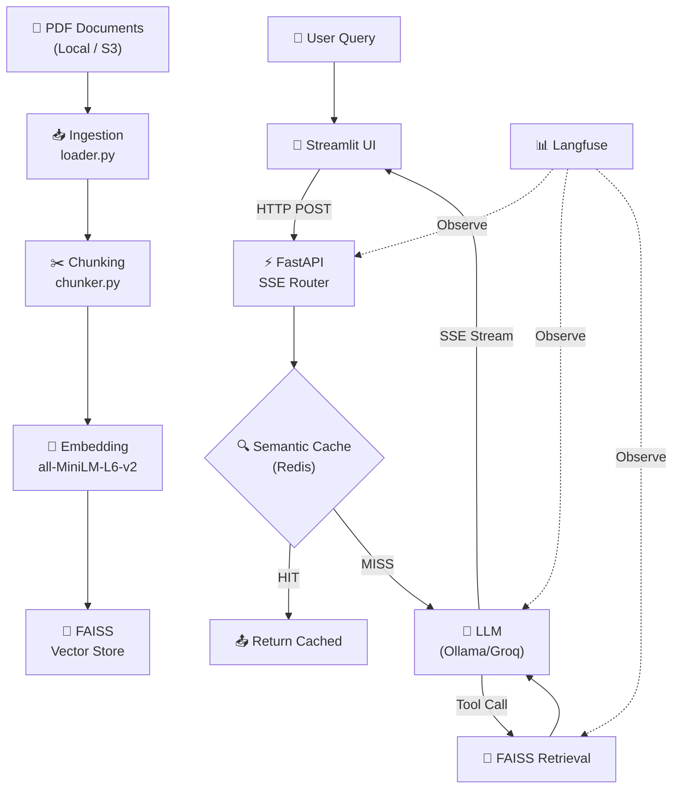

# 🤖 RAG Production System — Tổng Quan Dự Án (cho CV)

## 1. Mô Tả Ngắn Gọn

**Production-ready Retrieval-Augmented Generation (RAG) pipeline** — hệ thống hỏi đáp thông minh dựa trên tài liệu nội bộ, tích hợp đầy đủ các thành phần từ ingestion → retrieval → generation → caching → observability, được đóng gói Docker và deploy lên **HuggingFace Spaces**.

---

## 2. Kiến Trúc Hệ Thống

```
┌─────────────────────────────────────────────────────────────────┐
│                        USER (Browser)                           │
└──────────────────────────┬──────────────────────────────────────┘
                           │
                           ▼
┌──────────────────────────────────────────────────────────────────┐
│              Streamlit Chat UI (port 7860)                       │
│   • Session management (UUID)                                    │
│   • Real-time SSE streaming display                              │
└──────────────────────────┬──────────────────────────────────────┘
                           │ HTTP POST (SSE stream)
                           ▼
┌──────────────────────────────────────────────────────────────────┐
│              FastAPI Backend (port 8000)                         │
│   • SSE Router → StreamingResponse                              │
│   • Dependency Injection (Rag service)                           │
│   • Pydantic schema validation                                   │
└──────────────────────────┬──────────────────────────────────────┘
                           │
              ┌────────────┼────────────┐
              ▼            ▼            ▼
┌──────────────┐ ┌──────────────┐ ┌────────────────┐
│ Semantic     │ │ FAISS Vector │ │ LLM Provider   │
│ Cache        │ │ Store        │ │ (Ollama/Groq)  │
│ (Redis)      │ │ (all-MiniLM) │ │ Llama 3.2      │
└──────┬───────┘ └──────────────┘ └────────────────┘
       │                                    │
       │         ┌──────────────────────────┘
       ▼         ▼
┌──────────────────────────────────────────────────────────────────┐
│              Langfuse Observability                              │
│   • Tracing (session_id, user_id)                                │
│   • Prompt versioning & management                               │
│   • Generation & Retrieval span tracking                         │
└──────────────────────────────────────────────────────────────────┘
```

---

## 3. Tech Stack

| Layer | Công Nghệ |
|-------|-----------|
| **Backend API** | FastAPI + Uvicorn, SSE (Server-Sent Events) streaming |
| **Frontend** | Streamlit (chat UI với real-time streaming) |
| **LLM Framework** | LangChain + LangGraph (tool calling, prompt templates) |
| **LLM Providers** | Ollama (local Llama 3.2), Groq Cloud (Llama3-8B fallback) |
| **Embedding** | Sentence Transformers (`all-MiniLM-L6-v2`) via HuggingFace |
| **Vector Database** | FAISS (Facebook AI Similarity Search) |
| **Caching** | Redis 7 — Semantic Cache (cosine similarity threshold) |
| **Observability** | Langfuse (tracing, prompt management, LLM-as-a-judge eval) |
| **Document Ingestion** | PyPDF + AWS S3 (LocalStack) + LangChain loaders |
| **Containerization** | Docker multi-stage build + Docker Compose |
| **Deployment** | HuggingFace Spaces (Docker SDK) |
| **Package Manager** | `uv` (Astral) — lockfile-based dependency management |
| **Config Management** | Pydantic Settings + YAML config files |

---

## 4. Các Module Chính

### 4.1 Data Ingestion (`src/ingestion/`)
- Load PDF từ **local filesystem** hoặc **AWS S3** (LocalStack)
- Xử lý temp file trên Windows (OS lock fix)

### 4.2 Chunking (`src/chunking/`)
- **RecursiveCharacterTextSplitter** (chunk_size=1000, overlap=100)
- Hỗ trợ metadata tagging & overlap management

### 4.3 Embedding (`src/embedding/`)
- Model: `all-MiniLM-L6-v2` (Sentence Transformers)
- Abstract `BaseEmbedder` + OpenAI embedder extension
- **Semantic Cache** trên Redis: so sánh cosine similarity giữa query mới và cache, threshold configurable (mặc định 0.80)

### 4.4 Retrieval (`src/retrieval/`)
- **FAISS similarity search** với top-k configurable
- **LangChain StructuredTool** wrapping — LLM tự quyết định khi nào gọi retrieval (tool calling)
- Chuẩn bị sẵn module **Hybrid Retriever** (Dense FAISS + Sparse BM25 fusion)

### 4.5 Reranking (`src/reranking/`)
- Abstract `BaseReranker` interface
- **Cohere Reranker** implementation sẵn sàng

### 4.6 Generation (`src/generation/`)
- **Agentic RAG**: LLM bind tools → tự quyết gọi `search_docs` tool → retrieve context → generate response
- **SSE Streaming**: async generator yield từng chunk real-time
- **Prompt Management**: Langfuse prompt versioning (tạo/lấy prompt từ Langfuse cloud)
- Fallback thông minh: ưu tiên **Ollama local** → nếu không available thì dùng **Groq Cloud**

### 4.7 API Layer (`src/api/`)
- FastAPI router + SSE endpoint (`/sse-retrieve/`)
- Pydantic schemas (`RetrievalInput`: user_input, session_id, user_id)
- Dependency injection cho Rag service

### 4.8 Observability (Langfuse)
- **`@observe` decorator** trên toàn pipeline: RAG Systems → Retrieval Step → Generation
- Session tracking & user tracking
- Metadata logging (k_value, embedding_model, context retrieved)
- **Prompt versioning**: prompt được quản lý trên Langfuse, hỗ trợ A/B testing

### 4.9 Caching Layer (Redis)
- **2 tầng cache**:
  - `rag:retrieval:` — cache kết quả retrieval
  - `rag:response:` — cache toàn bộ response đã generate
- Semantic matching (không chỉ exact match) → tiết kiệm LLM cost
- TTL 24 giờ, hỗ trợ invalidate all khi data source cập nhật

### 4.10 DevOps & Deployment
- **Multi-stage Docker build** (builder → runtime, giảm image size)
- **Docker Compose**: Redis + App + Ollama (3 services)
- **Entrypoint script**: chạy FastAPI + Streamlit trong cùng 1 container, graceful shutdown
- **HuggingFace Spaces** deployment với Docker SDK
- Health check cho cả Redis và Streamlit

---

## 5. Điểm Nổi Bật (Highlights cho CV)

| # | Highlight |
|---|-----------|
| 1 | **Agentic RAG** — LLM sử dụng tool calling (LangChain) để tự quyết định khi nào cần truy vấn knowledge base |
| 2 | **Semantic Caching** 2 tầng trên Redis (retrieval + response), giảm latency & chi phí LLM |
| 3 | **Real-time SSE Streaming** — phản hồi từng token cho UX mượt mà |
| 4 | **Full Observability** với Langfuse — tracing, prompt versioning, evaluation-ready |
| 5 | **Multi-provider LLM** — tự động fallback từ Ollama local sang Groq Cloud |
| 6 | **Production-grade Docker** — multi-stage build, health checks, graceful shutdown |
| 7 | **Modular architecture** — separation of concerns rõ ràng (ingestion → chunking → embedding → retrieval → reranking → generation) |

---

## 6. Gợi Ý Bullet Points cho CV

### Tiếng Anh

> **RAG Production System** — End-to-End LLM Application
> - Designed and built a **production-ready RAG pipeline** with modular architecture (ingestion → chunking → embedding → retrieval → reranking → generation), deployed on **HuggingFace Spaces**
> - Implemented **Agentic RAG** using LangChain tool calling, enabling the LLM to autonomously decide when to query the knowledge base
> - Built a **2-layer Redis semantic cache** (retrieval + response) using cosine similarity matching, reducing LLM API costs and latency by caching semantically similar queries
> - Developed **real-time SSE streaming API** with FastAPI, delivering token-by-token responses to a Streamlit chat interface
> - Integrated **Langfuse observability** for end-to-end tracing, prompt versioning, and LLM-as-a-judge evaluation readiness
> - Engineered **multi-provider LLM fallback** (Ollama local → Groq Cloud) for resilient inference
> - Containerized with **multi-stage Docker build** and Docker Compose (Redis + App + Ollama), with health checks and graceful shutdown
> - **Tech**: Python, FastAPI, LangChain, FAISS, Sentence Transformers, Redis, Langfuse, Docker, Streamlit

### Tiếng Việt

> **RAG Production System** — Ứng Dụng LLM End-to-End
> - Thiết kế và xây dựng **pipeline RAG production-ready** với kiến trúc modular (ingestion → chunking → embedding → retrieval → reranking → generation), deploy trên **HuggingFace Spaces**
> - Triển khai **Agentic RAG** sử dụng LangChain tool calling, LLM tự quyết định khi nào cần truy vấn knowledge base
> - Xây dựng **semantic cache 2 tầng trên Redis** (retrieval + response) sử dụng cosine similarity, giảm chi phí API LLM và độ trễ
> - Phát triển **SSE streaming API** real-time với FastAPI, phản hồi token-by-token tới giao diện Streamlit chat
> - Tích hợp **Langfuse observability** cho tracing end-to-end, quản lý prompt version, và evaluation
> - Thiết kế **multi-provider LLM fallback** (Ollama local → Groq Cloud) đảm bảo tính sẵn sàng
> - Đóng gói **Docker multi-stage build** + Docker Compose (Redis + App + Ollama), health check, graceful shutdown
> - **Công nghệ**: Python, FastAPI, LangChain, FAISS, Sentence Transformers, Redis, Langfuse, Docker, Streamlit

---

## 7. Sơ Đồ Module


